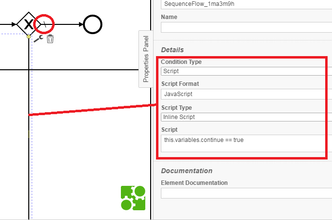

This component drives the showing of data forms based on a workflow.

### Usage:

##### Important notes:

- This component was tested only for workflows edited with Camunda editor;

##### Workflow requirements:

- Activities should have either the ``Id`` or ``Form key`` property matching the ``key`` property of one of the created forms in the app.
- Exclusive gateway's arrows coming out should be assigned a condition or be marked as default (oblique short straight line)

``this.variables`` is an object containing workflow variables.

##### Workflow definition loading:

Click on ``Load BPMN file`` and select the BPMN 2.0 file.

##### Workflow variables definition loading:

Click on ``Load JSON file with variable definitions`` and select a workflow variables definition JSON file. Such a file is a standard JSON file that can contain [JSON pointers](https://tools.ietf.org/html/rfc6901) and [Mustache](https://github.com/janl/mustache.js) templates. Example:

```json
{
	"schemaVersion": 1,
	"initial": {
		"continue": false,
		"main_researcher": "john doe",
		"helper": "davide monari"
	},
	"on_activity_wait": {
		"actor": {
			"$ref": "#/initial/{{task.lane.id}}"
		}
	}
}
```

where:
- ``schemaVersion``: leave it as above;
- ``initial``: object defining variables names and values at loading;
- ``on_activity_wait``: object defining how variables should be updated while waiting for a completion of an activity. In the example, the variable ``actor`` (referring to the current person performing an action) is updated with the id of the lane wrapping the waiting task, available as an engine runtime variable ``task.lane.id``. What is important in this example, is that the lane ``Id`` property must have been set in the BPMN file for the 2 involved lanes, ``main_researcher`` and ``helper``. ``actor`` can than be used inside the app and, for instance, be assigned to the ``researcher`` field in a form, so that a user does not have to type it manually.

##### Play/stop/pause workflow:

Once BPMN and variables files are uploaded, the user can run the workflow. The form related to the current activity should appear. Otherwise, a message is indicated. Upon submission, the next activity in the workflow should come, etc. By clicking on ``show current task``, an external window with the full workflow is shown. The current activity is colored in green. ``Waiting activities number`` is mostly used for parallel gateways ("+" symbols) to indicate how many activities in parallel are waiting to be completed.
